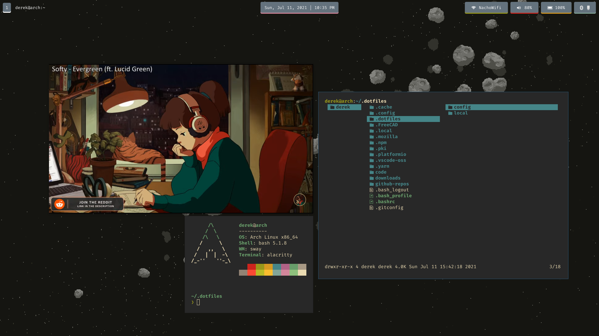

# dotfiles 🐧

I use [`stow`](https://www.gnu.org/software/stow/manual/stow.html) to manage my dotfiles. 

	Sway		(Window Manager)
	Waybar		(Status Bar)
	Alacritty	(Terminal)
	Lf		(File Browser)
	Neovim		(Text Editor)
	Brave		(Web Browser)
